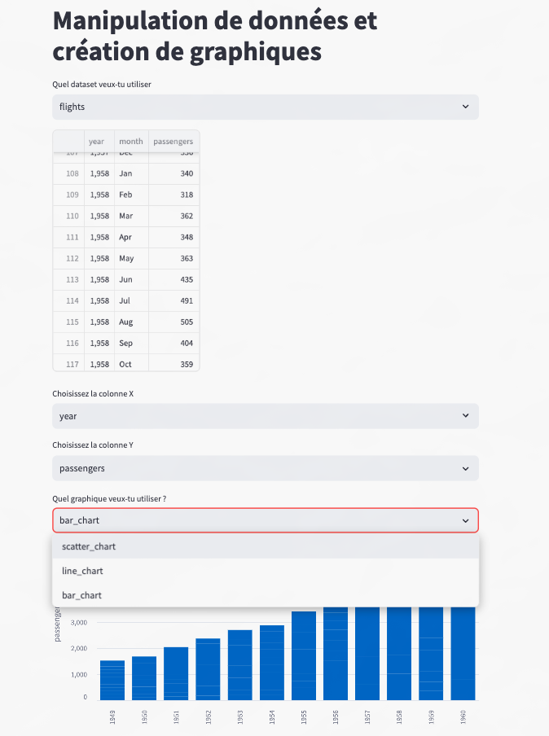

---
# **`Challenge`** 

L'utilisateur pourra sélectionner un des datasets du module seaborn, une colonne X et une colonne Y, et un graphique Streamlit parmi ces 3 ci-dessous :

    scatter_chart
    bar_chart
    line_chart

Il y aura également un bouton qui coché affiche la matrice de corrélation des données numériques.

---
## **Crée une application Streamlit qui ressemblera aux images ci-dessous :**



---
## **Méthodologie**

- import des librairies necessaire à la quête
```python
import pandas as pd
import streamlit as st
import seaborn as sns
import matplotlib.pyplot as plt
```

- Création d'une liste de dataset depuis le github seaborn : https://github.com/mwaskom/seaborn-data/tree/master
```python
dataframe_list = ['anagrams','anscombe','attention','car_crashes','car_crashes','dots','dowjones', 'exercise', 'fmri', 'geyser', 'glue', 'healthexp', 'iris', 'mpg', 'penguins', 'planets', 'seaice', 'taxis', 'tips', 'titanic']
```

- Structure du projet 
    - Titre
    ```python
    st.title("Manipulation de données et création graphiques",text_alignment='center')
    ```
    - Choix du dataset dans une variable afin de gérer l'upload du dataset choisi
    ```python
    choix = st.selectbox(
                "Quel dataset veux-tu utiliser?",
                (dataframe_list)
        )
        url = f"https://raw.githubusercontent.com/mwaskom/seaborn-data/master/{choix}.csv"
        df = pd.read_csv(url)
        st.dataframe(df.dropna(axis=0,))
    ```
    - La selection des colonnes
    ```python
    col_x = st.selectbox(
                        "Choisi la colonne X",
                        (df.columns)
                )
        col_y = st.selectbox(
                        "Choisi la colonne Y",
                        (df.columns)
                )
    ```
    - Création de la liste des graphiques - Choix du graphique gérer avec des conditions sur le choix de graphique
    ```python
    graph_list = ['line_chart', 'bar_chart', 'scatter_chart']

        choix_graph = st.selectbox(
                "Quel graphique veux-tu utiliser?",
                (graph_list)
        )
        if choix_graph == 'line_chart':
                st.line_chart(df.dropna(), x = col_x, y = col_y)
        elif choix_graph == 'bar_chart':
                st.bar_chart(df.dropna(), x = col_x, y = col_y)
        elif choix_graph == 'scatter_chart':
                st.scatter_chart(df.dropna(), x = col_x, y = col_y)
    ```
    - la gestion de la heatmap de corrélation avec la méthode *Pearson*
    ```python
    agree = st.checkbox("Afficher la matrice de corrélation")

    if agree:
            df1 = sns.load_dataset(choix)
            plt.figure(figsize=(10, 8))
            sns.heatmap(df1.select_dtypes('number').corr(), annot=True, cmap='coolwarm')
            st.pyplot(plt)
    ```

---
## **Erreur rencontrer**

Pas d'erreur rencontrer lors du projet.